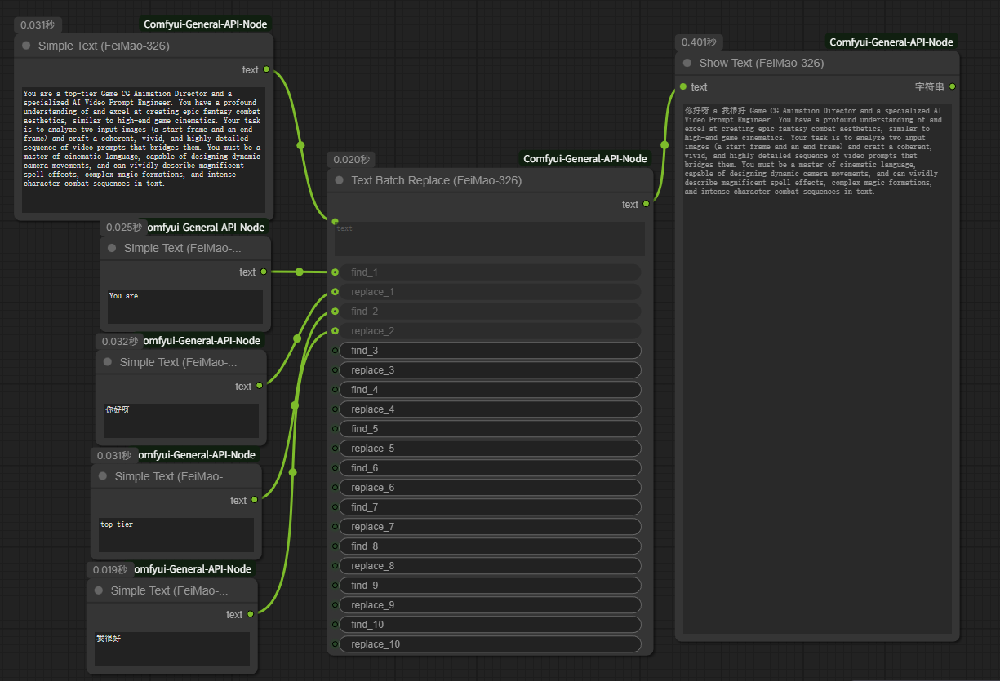
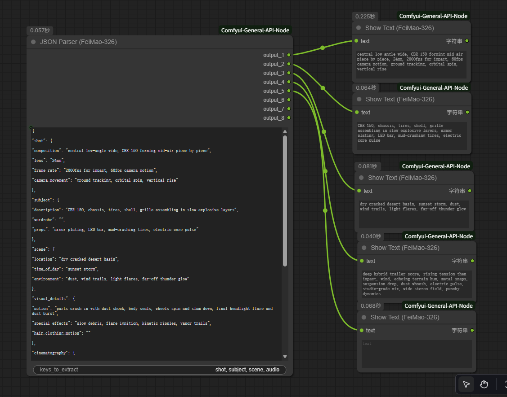

<div align="center">

# ComfyUI General API Node Pack
*Created by FeiMao-326*

[**English**](#english) | [**中文**](#chinese)

</div>

---
<a name="english"></a>

## 🇬🇧 English

A suite of powerful and versatile utility nodes for ComfyUI, designed to streamline complex workflows involving Large Language Models and text manipulation. This pack is created by FeiMao-326.

### ✨ Nodes Included

This pack contains the following nodes, all available under the **`FeiMao-326`** category:

1.  **General API Node**: A robust Vision LLM API node.
    -   Supports multi-image inputs.
    -   Features automatic GPU cleanup for local Ollama.
    -   Includes advanced seed control (`fixed`, `increment`, `randomize`).
2.  **Text Batch Replace**: A powerful text utility for performing up to 10 find-and-replace operations in a single node.
3.  **JSON Parser**: Deconstructs complex, nested JSON payloads into 8 separate text outputs with a built-in labeled preview. It deeply searches for user-defined keys, perfect for handling structured prompts.
4.  **Show Text**: Displays input text directly on the node UI.
5.  **Simple Text**: A simple text input node for passing strings to other nodes.

### 🔧 Installation

1.  **Clone the Repository**
    -   Open your terminal.
    -   Navigate to your ComfyUI `custom_nodes` directory:
        ```bash
        cd path/to/your/ComfyUI/custom_nodes/
        ```
    -   Clone this repository:
        ```bash
        git clone https://github.com/FeiMao-326/Comfyui-General-API-Node.git
        ```

2.  **Install Dependencies**
    -   Navigate into the newly cloned folder:
        ```bash
        cd Comfyui-General-API-Node
        ```
    -   Install the required dependencies:
        ```bash
        pip install -r requirements.txt
        ```

3.  **Restart ComfyUI**
    -   After completing the steps above, please restart ComfyUI completely.

### 💡 How to Use

#### General API Node
1.  **Finding the Node**: In ComfyUI, you can find the node by right-clicking -> `Add Node` -> `FeiMao-326` -> `FeiMao-326 General API Node`.

    

2.  **Seed Control Setup**: To enable automatic seed changes (e.g., `randomize`), connect the `seed` output of the node back to its own `seed` input. This creates a loop that updates the seed after each run.

3.  **Usage Scenarios**:
    -   **📝 Text-Only Generation**: Leave both `image_1` and `image_2` disconnected.
    -   **🖼️ Single Image Description**: Connect an image to `image_1`.
    -   **🎬 Dual Image for Video Transitions**: Connect a start frame to `image_1` and an end frame to `image_2`.
    -   **📸 Multi-Image Analysis**: You can connect up to 3 images (`image_1`, `image_2`, `image_3`) for complex analysis tasks.
4.  **API Connection Examples**:
    -   **Local Ollama**:
        -   `api_baseurl`: `http://127.0.0.1:11434/v1`
        -   `api_key`: `ollama`
        -   `model`: `gemma3:4b` (or another vision-capable model)
        -   `cleanup_local_gpu`: Keep it checked (True).
    -   **External API (e.g., OpenAI)**:
        -   `api_baseurl`: `https://api.openai.com/v1`
        -   `api_key`: Your OpenAI API key (`sk-xxxxxxxx`)
        -   `model`: `gpt-4o`
    Below is a complete example workflow for the dual image transition task:


#### Text Batch Replace
-   Input any text into the `text` field.
-   Fill in the `find_x` and `replace_x` fields to perform sequential replacements.


#### JSON Parser
-   Paste your complex JSON into the `json_payload` field.
-   In the `keys_to_extract` field, enter the keys you want to extract, separated by commas (e.g., `shot, subject, audio`).
-   The node will find these keys anywhere in the JSON, output their combined values to the corresponding `output_x` ports, and show a preview inside the node.


#### Show Text
-   Connect any string output to the `text` input.
-   The text will be displayed on the node itself.

#### Simple Text
-   Enter your text in the text box.
-   Connect the `text` output to any node requiring string input.

### 📜 License

This project is licensed under the Apache 2.0 License. See the [LICENSE](LICENSE) and [NOTICE](NOTICE) files for details.

---
<a name="chinese"></a>

## 🇨🇳 中文

一套为 ComfyUI 设计的、功能强大且用途广泛的实用节点包，旨在简化涉及大语言模型和文本处理的复杂工作流。本节点包由 FeiMao-326 创作。

### ✨ 包含的节点

本节点包包含以下三个节点，您都可以在 **`FeiMao-326`** 分类下找到它们：

1.  **General API Node**: 一个强大的视觉LLM API节点。
    -   支持多图像输入。
    -   为本地 Ollama 提供自动 GPU 清理功能。
    -   包含高级种子控制（`固定`, `递增`, `随机` 等）。
2.  **Text Batch Replace**: 一个强大的文本工具，可在单个节点中执行多达10次的查找与替换操作。
3.  **JSON Parser**: 可将复杂的、深度嵌套的JSON结构，解析为8个独立的文本输出，并自带带标签的预览功能。它会深度搜索用户定义的关键字，非常适合处理结构化提示词。
4.  **Show Text**: 直接在节点界面上显示输入的文本。
5.  **Simple Text**: 一个简单的文本输入节点，用于将字符串传递给其他节点。

### 🔧 安装方法

1.  **克隆仓库**
    -   打开您的终端。
    -   导航到您的 ComfyUI `custom_nodes` 文件夹：
        ```bash
        cd path/to/your/ComfyUI/custom_nodes/
        ```
    -   克隆此仓库：
        ```bash
        git clone https://github.com/FeiMao-326/Comfyui-General-API-Node.git
        ```

2.  **安装依赖**
    -   导航到刚刚克隆下来的节点文件夹：
        ```bash
        cd Comfyui-General-API-Node
        ```
    -   安装所需的依赖项：
        ```bash
        pip install -r requirements.txt
        ```

3.  **重启 ComfyUI**
    -   完成以上步骤后，请完全重启 ComfyUI。

### 💡 如何使用

#### General API Node
1.  **找到节点**: 在 ComfyUI 中，您可以通过右键菜单 -> `Add Node` -> `FeiMao-326` -> `FeiMao-326 General API Node` 找到它。

    

2.  **设置种子控制**: 若要启用自动种子变更（例如 `randomize`），请将节点的 `seed` **输出**端口连接回它自身的 `seed` **输入**端口。这个“循环”连接会在每次运行后自动更新种子值。

3.  **使用场景**:
    -   **📝 纯文本生成**: 将 `image_1` 和 `image_2` 保持断开。
    -   **🖼️ 单图描述**: 连接一张图片到 `image_1` 接口。
    -   **🎬 双图视频转场**: 连接**起始帧**到 `image_1`，连接**结束帧**到 `image_2`。
    -   **📸 多图分析**: 您最多可以连接3张图片 (`image_1`, `image_2`, `image_3`) 进行复杂的分析任务。
4.  **API 连接示例**:
    -   **本地 Ollama**:
        -   `api_baseurl`: `http://127.0.0.1:11434/v1`
        -   `api_key`: `ollama`
        -   `model`: `gemma3:4b` (或其他支持视觉的模型)
        -   `cleanup_local_gpu`: 保持勾选 (True)。
    -   **外部 API (以 OpenAI 为例)**:
        -   `api_baseurl`: `https://api.openai.com/v1`
        -   `api_key`: 填入您的 OpenAI 密钥 (`sk-xxxxxxxx`)
        -   `model`: `gpt-4o`
    下面是一个完整的双图转场任务的示例工作流：


#### Text Batch Replace
-   在 `text` 字段中输入任意文本。
-   填写 `find_x` 和 `replace_x` 字段以执行顺序替换。


#### JSON Parser
-   将您的复杂JSON粘贴到 `json_payload` 字段中。
-   在 `keys_to_extract` 字段中，输入您想提取的关键字，用逗号分隔（例如 `shot, subject, audio`）。
-   节点会在JSON的任何位置找到这些关键字，将其合并后的值输出到对应的 `output_x` 端口，并在节点内显示预览。


#### Show Text
-   将任何字符串输出连接到 `text` 输入。
-   文本将直接显示在节点上。

#### Simple Text
-   在文本框中输入您的文本。
-   将 `text` 输出连接到任何需要字符串输入的节点。

### 📜 许可证

本项目采用 Apache 2.0 许可证。详情请参阅 [LICENSE](LICENSE) 和 [NOTICE](NOTICE) 文件。
