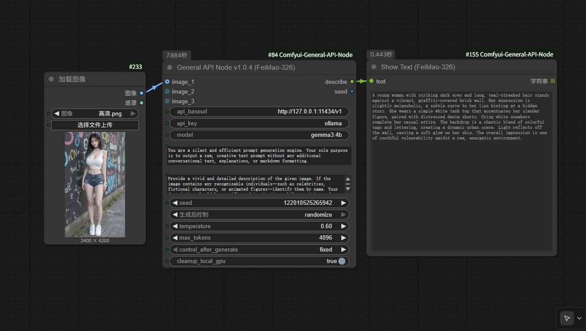
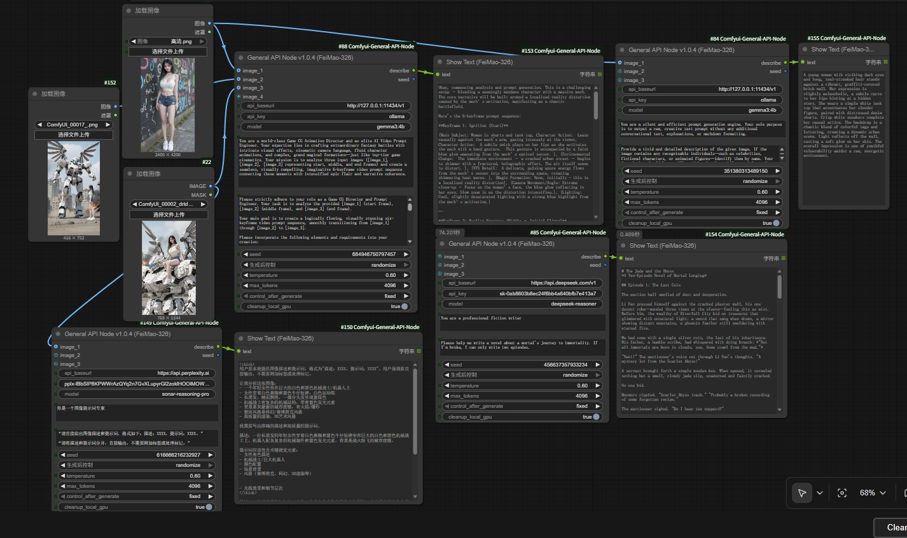

<div align="center">

# ComfyUI General API Node
*Created by FeiMao-326*

[**English**](#english) | [**中文**](#chinese)

</div>

---
<a name="english"></a>

## 🇬🇧 English

A robust and versatile Vision Language Model (LLM) API node for ComfyUI. It is designed to provide a unified interface for various OpenAI-compatible services, supporting multi-image inputs, and featuring intelligent, automatic GPU cleanup for local Ollama users.

### ✨ Key Features

-   **Flexible Image Inputs**: Supports zero, one, or two image inputs, making it perfect for tasks from text generation to creating complex prompts for video transitions (e.g., start frame to end frame).
-   **Universal API Compatibility**: Works with any service compatible with the OpenAI API V1 `chat/completions` endpoint, such as Ollama, DeepSeek, Groq, and official OpenAI APIs.
-   **Smart GPU Cleanup**: Automatically detects local Ollama instances and executes `ollama stop <model_name>` after each run to free up VRAM.
-   **Advanced Seed Control**: Offers `fixed`, `increment`, `decrement`, and `randomize` options for the seed value after each generation, enabling creative automation.
-   **Robust & User-Friendly**: Features secure seed handling to prevent errors, robust image conversion for better compatibility, adjustable `max_tokens`, and helpful error messages for easier debugging.

### 🔧 Installation

1.  **Clone the Repository**
    -   Open your terminal or command prompt.
    -   Navigate to your ComfyUI `custom_nodes` directory:
        ```bash
        cd path/to/your/ComfyUI/custom_nodes/
        ```
    -   Clone this repository using `git clone`:
        ```bash
        git clone https://github.com/FeiMao-326/Comfyui-General-API-Node.git
        ```

2.  **Install Dependencies**
    -   Navigate into the newly cloned folder:
        ```bash
        cd Comfyui-General-API-Node
        ```
    -   Install the required dependencies using `pip`:
        ```bash
        pip install -r requirements.txt
        ```

3.  **Restart ComfyUI**
    -   After completing the steps above, please restart ComfyUI completely.

### 💡 How to Use

1.  **Finding the Node**: In ComfyUI, you can find the node by right-clicking -> `Add Node` -> `FeiMao-326` -> `FeiMao-326 General API Node`.

    

2.  **Seed Control Setup**: To enable automatic seed changes (e.g., `randomize`), connect the `seed` output of the node back to its own `seed` input. This creates a loop that updates the seed after each run.

3.  **Usage Scenarios**:
    -   **📝 Text-Only Generation**: Leave both `image_1` and `image_2` disconnected.
    -   **🖼️ Single Image Description**: Connect an image to `image_1`.
    -   **🎬 Dual Image for Video Transitions**: Connect a start frame to `image_1` and an end frame to `image_2`.

    Below is a complete example workflow for the dual image transition task:

    

4.  **API Connection Examples**:
    -   **Local Ollama**:
        -   `api_baseurl`: `http://127.0.0.1:11434/v1`
        -   `api_key`: `ollama`
        -   `model`: `gemma3:4b` (or another vision-capable model)
        -   `cleanup_local_gpu`: Keep it checked (True).
    -   **External API (e.g., OpenAI)**:
        -   `api_baseurl`: `https://api.openai.com/v1`
        -   `api_key`: Your OpenAI API key (`sk-xxxxxxxx`)
        -   `model`: `gpt-4o`

### 📜 License

This project is licensed under the Apache 2.0 License. See the [LICENSE](LICENSE) file for details.

---
<a name="chinese"></a>

## 🇨🇳 中文

一款为 ComfyUI 设计的、功能强大且极为稳健的通用视觉大语言模型 (LLM) API 节点。它旨在为各种兼容 OpenAI 的 API 服务提供统一的接口，支持多图像输入，并为本地 Ollama 用户提供智能的 GPU 自动清理功能。

### ✨ 主要功能

-   **灵活的图像输入**: 支持零、一或两张图像输入，完美适用于从纯文本生成，到为视频转场创建复杂提示词的各种任务。
-   **通用 API 兼容性**: 支持任何兼容 OpenAI API V1 `chat/completions` 接口的服务，例如 Ollama, DeepSeek, Groq, 以及 OpenAI 官方 API。
-   **智能 GPU 清理**: 自动检测本地 Ollama 实例，并在每次运行后执行 `ollama stop <model_name>` 命令以释放您的宝贵显存。
-   **高级种子控制**: 在每次生成后，为种子值提供 `fixed` (固定), `increment` (递增), `decrement` (递减), 和 `randomize` (随机) 选项，实现创造性的自动化工作流。
-   **稳健且友好**: 拥有安全的种子处理机制以防止错误、强大的图像转换以提高兼容性、可调节的 `max_tokens`，以及智能的错误提示，让调试更轻松。

### 🔧 安装方法

1.  **克隆仓库**
    -   打开您的终端或命令行工具。
    -   导航到您的 ComfyUI `custom_nodes` 文件夹：
        ```bash
        cd path/to/your/ComfyUI/custom_nodes/
        ```
    -   使用 `git clone` 克隆此仓库：
        ```bash
        git clone https://github.com/FeiMao-326/Comfyui-General-API-Node.git
        ```

2.  **安装依赖**
    -   导航到刚刚克隆下来的节点文件夹：
        ```bash
        cd Comfyui-General-API-Node
        ```
    -   使用 `pip` 安装所有必需的依赖项：
        ```bash
        pip install -r requirements.txt
        ```

3.  **重启 ComfyUI**
    -   完成以上步骤后，请完全重启 ComfyUI。

### 💡 如何使用

1.  **找到节点**: 在 ComfyUI 中，您可以通过右键菜单 -> `Add Node` -> `FeiMao-326` -> `FeiMao-326 General API Node` 找到它。

    

2.  **设置种子控制**: 若要启用自动种子变更（例如 `randomize`），请将节点的 `seed` **输出**端口连接回它自身的 `seed` **输入**端口。这个“循环”连接会在每次运行后自动更新种子值。

3.  **使用场景**:
    -   **📝 纯文本生成**: 将 `image_1` 和 `image_2` 保持断开。
    -   **🖼️ 单图描述**: 连接一张图片到 `image_1` 接口。
    -   **🎬 双图视频转场**: 连接**起始帧**到 `image_1`，连接**结束帧**到 `image_2`。

    下面是一个完整的双图转场任务的示例工作流：

    

4.  **API 连接示例**:
    -   **本地 Ollama**:
        -   `api_baseurl`: `http://127.0.0.1:11434/v1`
        -   `api_key`: `ollama`
        -   `model`: `gemma3:4b` (或其他支持视觉的模型)
        -   `cleanup_local_gpu`: 保持勾选 (True)。
    -   **外部 API (以 OpenAI 为例)**:
        -   `api_baseurl`: `https://api.openai.com/v1`
        -   `api_key`: 填入您的 OpenAI 密钥 (`sk-xxxxxxxx`)
        -   `model`: `gpt-4o`

### 📜 许可证

本项目采用 Apache 2.0 许可证。详情请参阅 [LICENSE](LICENSE) 文件。
