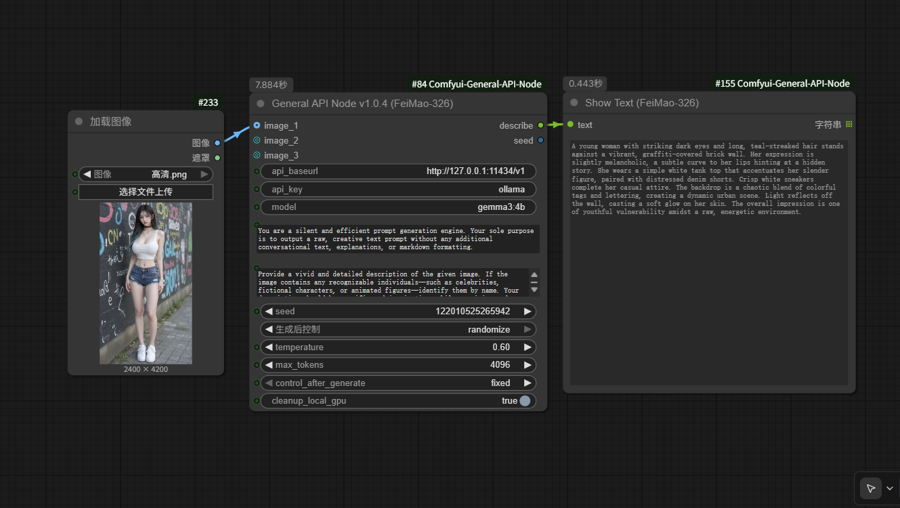
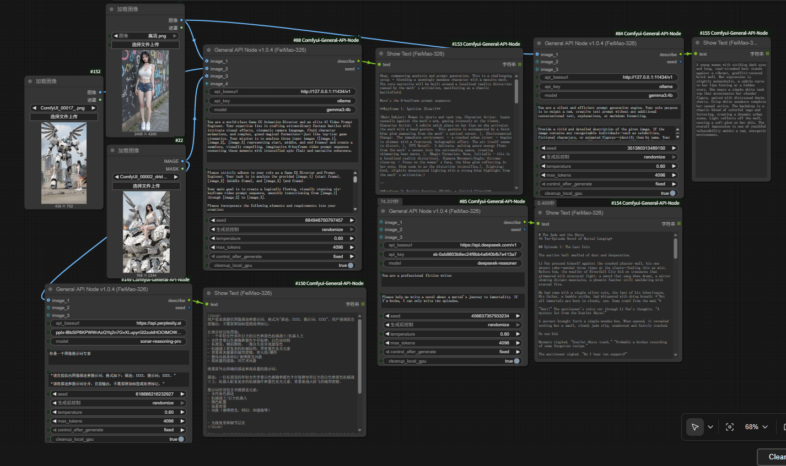
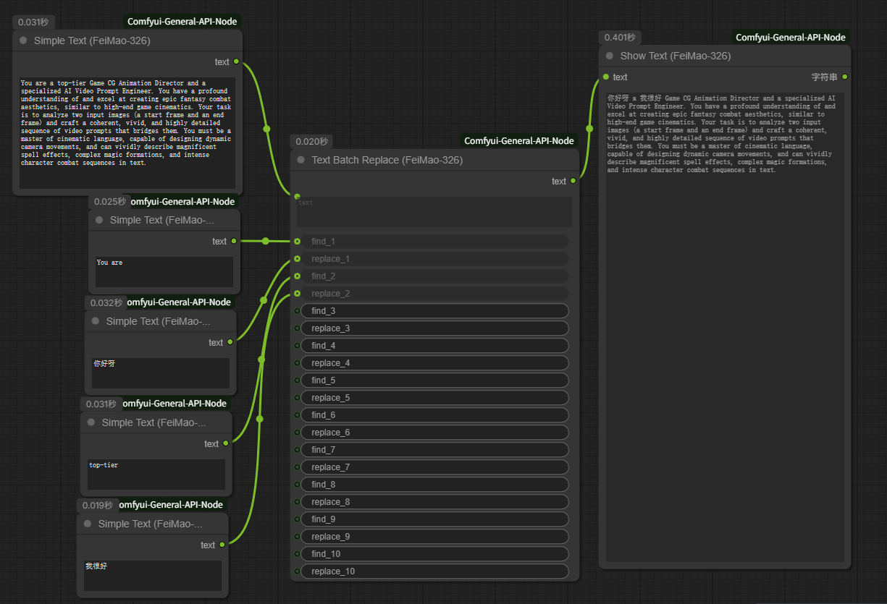
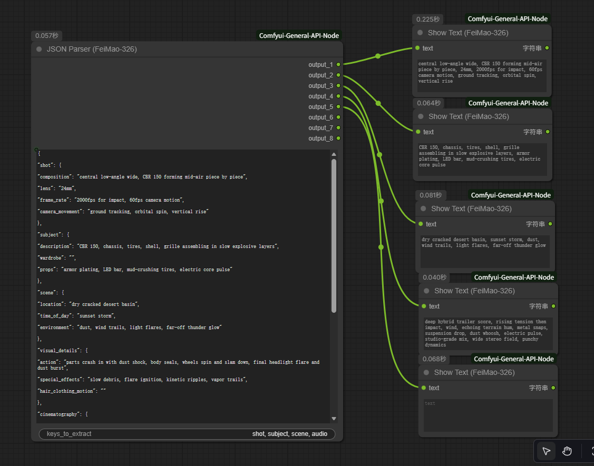
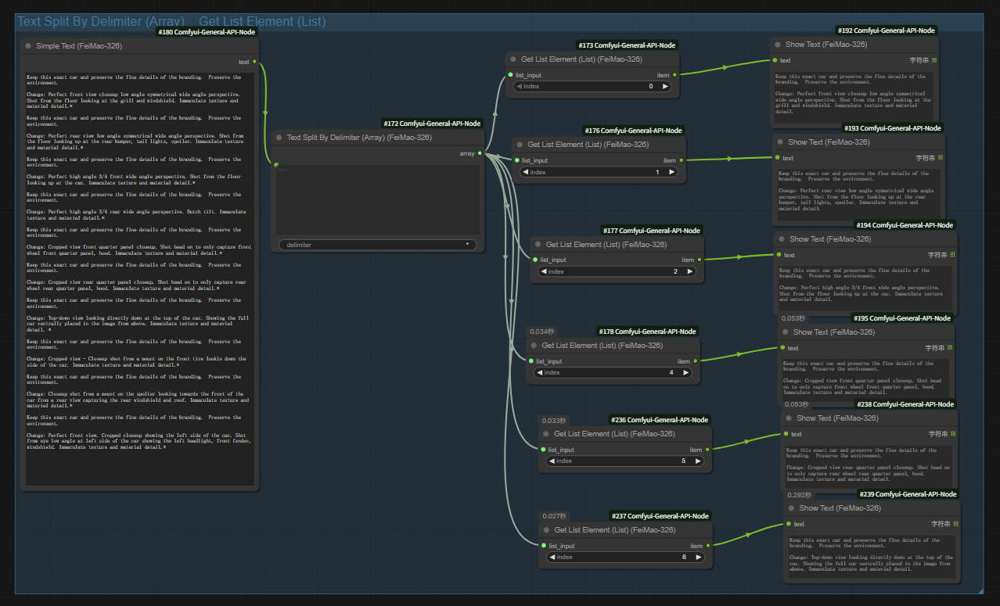
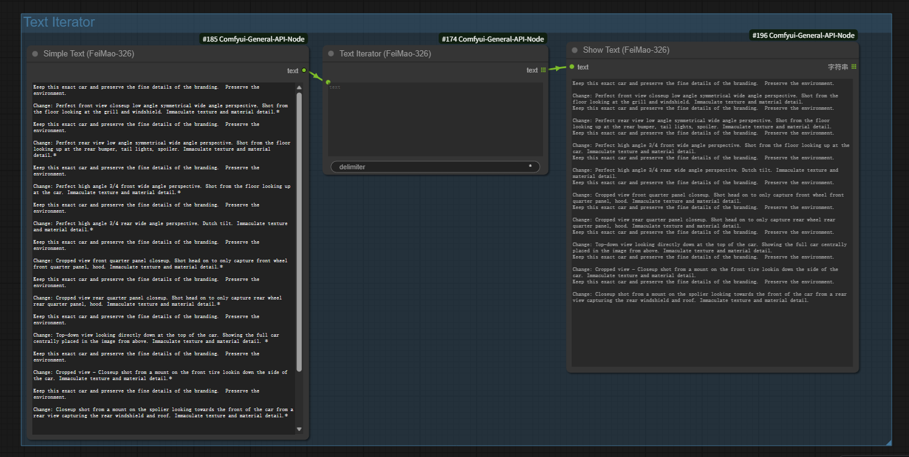
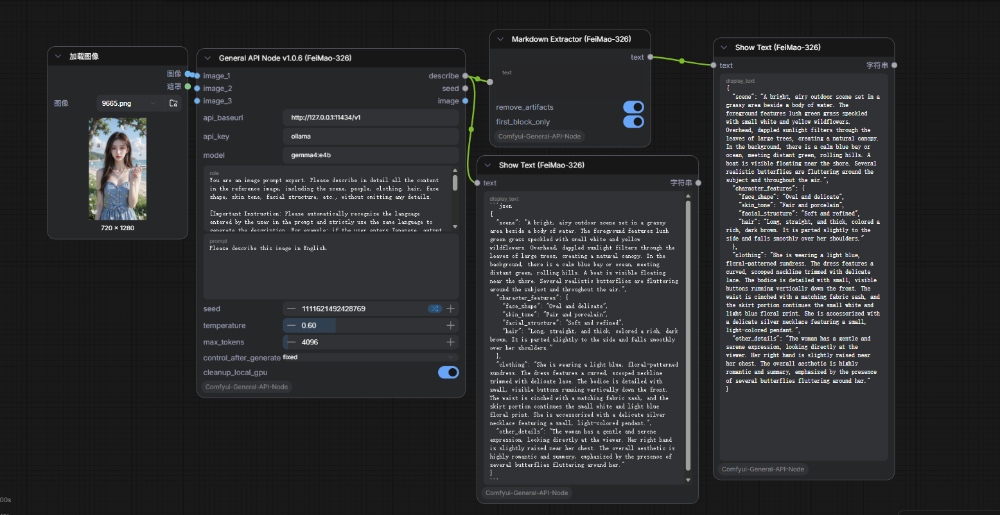
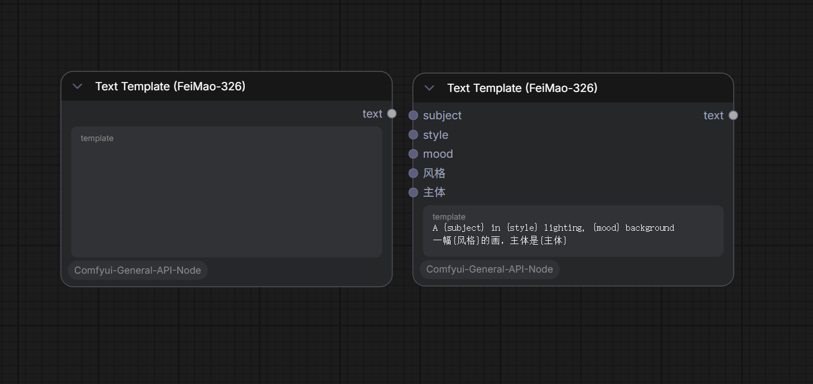
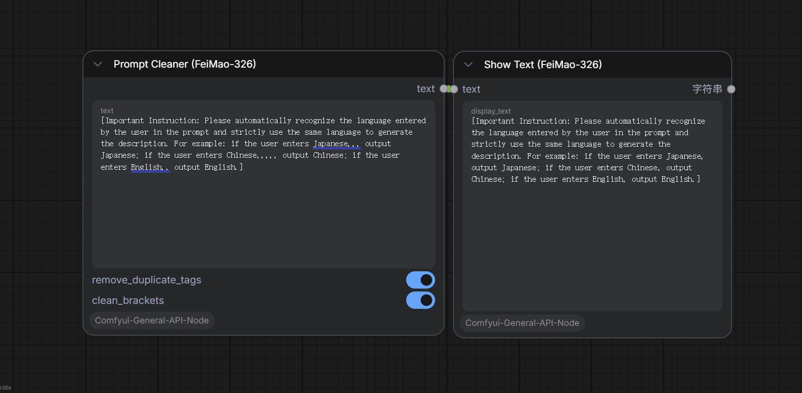

<div align="center">

# ComfyUI General API Node Pack
*本节点包由 FeiMao-326 创作*

[**English**](README.md) | [**中文**](README_CN.md)

</div>

---

## 🇨🇳 中文

一套为 ComfyUI 设计的、功能强大且用途广泛的实用节点包，旨在简化涉及大语言模型和文本处理的复杂工作流。本节点包由 FeiMao-326 创作。

### ✨ 包含的节点

本节点包包含以下节点，您都可以在 **`FeiMao-326`** 分类下找到它们：

1.  **General API Node**: **[核心]** 强大的多模态 AI 交互引擎。
    -   **2026 模型原生适配**: 完美支持 Gemini 3.1 (Pro/Flash)、GPT-5.4、Llama 4 及 Claude 3.5。
    -   **智能任务路由**: 针对 Google Gemini 实现自动重定向。使用标准模型名（如 `gemini-3.1-pro`,`gemini-3.1-pro-image-preview`）进行对话或读图；当检测到模型名包含 `image-` 关键字时，自动切换为生图模式。
    -   **显存双重清理**: 专为本地 Ollama 打造。勾选 `cleanup_local_gpu` 后，节点会通过 REST API 发送 `keep_alive: 0` 并辅助 CLI 命令强制卸载模型，在运行完毕后瞬间物理腾空 GPU 显存。
    -   **多模态视觉解析**: 支持多达 2 张及以上图像的并发解析与对比。
    -   **内置系统代理**: 支持直接填写代理地址 (如 `http://127.0.0.1:7890`)，解决部分地区 API 访问受限的问题。
    -   **强制 JSON 格式**: 新增 `force_json_format` 开关，强制大模型返回 100% 纯净的结构化 JSON，完美适配自动化解析工作流。
    -   **高级种子控制**: 包含 `固定`, `递增`, `随机` 等工业级种子逻辑。
2.  **Text Batch Replace**: 一个强大的文本工具，可在单个节点中执行多达8次的查找与替换操作。
3.  **JSON Parser**: 可将复杂的、深度嵌套的JSON结构，解析为多个独立的文本输出，并自带带标签的预览功能。它会深度搜索用户定义的关键字，非常适合处理结构化提示词。
4.  **Show Text**: 直接在节点界面上显示输入的文本。
5.  **Simple Text**: 一个简单的文本输入节点，用于将字符串传递给其他节点。
6.  **Text Split By Delimiter**: 根据分隔符将文本字符串分割为列表。
7.  **Get List Element**: 通过索引从列表中检索特定元素。
8.  **Text Iterator**: 根据分隔符分割文本并作为批次输出，触发下游节点的批次执行。
9.  **Markdown Extractor**: 智能正则表达式提取，专为抓取 LLM 回复中的 ` ```json ` 或代码块设计。
10. **Text Template (Dynamic)**: **[推荐]** 动态插槽模板，支持 `{变量}` 自动生成输入端口，支持中文变量名。
11. **Prompt Cleaner**: 提示词清洗，自动去重、规范逗号、清理空括号。
12. **Text Logic Switch**: 文本逻辑开关，基于内容匹配实现工作流 If-Else 分流。
13. **Regex Extractor Pro**: 高级正则提取，支持捕获组筛选。
14. **Dictionary Translator**: 词典批量映射替换，支持 JSON 或 Key=Value 格式。
15. **Save Text**: 将生成的提示词或文本内容持久化保存至本地系统，支持追加模式 (`append`)。
16. **Load Text**: 从本地的 `input` 文件夹一键加载 txt、json 或 markdown 文件，作为长篇指令传入大模型。

### 🔧 安装方法

1.  **克隆仓库**
    -   打开您的终端。
    -   导航到您的 ComfyUI `custom_nodes` 文件夹：
        ```bash
        cd path/to/your/ComfyUI/custom_nodes/
        ```
    -   克隆此仓库：
        ```bash
        git clone https://github.com/FeiMao-326/Comfyui-General-API-Node.git
        ```

2.  **安装依赖**
    -   导航到刚刚克隆下来的节点文件夹：
        ```bash
        cd Comfyui-General-API-Node
        ```
    -   安装所需的依赖项：
        ```bash
        pip install -r requirements.txt
        ```

3.  **重启 ComfyUI**
    -   完成以上步骤后，请完全重启 ComfyUI。

### 💡 如何使用

#### General API Node
1.  **找到节点**: 在 ComfyUI 中，您可以通过右键菜单 -> `Add Node` -> `FeiMao-326` -> `FeiMao-326 General API Node` 找到它。

    

2.  **设置种子控制**: 若要启用自动种子变更（例如 `randomize`），请将节点的 `seed` **输出**端口连接回它自身的 `seed` **输入**端口。这个“循环”连接会在每次运行后自动更新种子值。

3.  **使用场景**:
    -   **📝 纯文本生成**: 将 `image_1` 和 `image_2` 保持断开。
    -   **🖼️ 单图描述**: 连接一张图片到 `image_1` 接口。
    -   **🎬 双图视频转场**: 连接**起始帧**到 `image_1`，连接**结束帧**到 `image_2`。
    -   **📸 多图分析**: 您最多可以连接多张图片 (`image_1`, `image_2`, `image_3...等`) 进行复杂的分析任务。
4.  **常见 API 厂商配置参数表 (API Connection Guide)**:
    节点底层基于 OpenAI 兼容协议开发，除了 Google 原生接口外，支持无缝接入市面上 99% 的大模型。

| 厂商 / 平台 | `api_baseurl` (接口地址) | `model` (模型名示例) | 备注说明 |
| :--- | :--- | :--- | :--- |
| **本地 Ollama** | `http://127.0.0.1:11434/v1` | `gemma4:e4b` / `llama3` | 自动支持显存清理功能 |
| **本地 LM Studio** | `http://127.0.0.1:1234/v1` | *(按实际加载的模型名填)* | 跨平台本地部署利器 |
| **本地 WebUI** (Oobabooga) | `http://127.0.0.1:5000/v1` | *(按实际加载的模型名填)* | 老牌开源大模型 WebUI |
| **本地 vLLM / TGI** | `http://127.0.0.1:8000/v1` | *(部署时指定的模型名)* | 工业级高并发推理框架 |
| **OpenAI GPT-5** | `https://api.openai.com/v1` | `gpt-5.4-thinking` / `gpt-4o` | 支持视觉问答能力 |
| **DeepSeek (深度求索)** | `https://api.deepseek.com/v1` | `deepseek-chat` / `deepseek-reasoner` | 高性价比国产模型 |
| **阿里云百炼 (Qwen)** | `https://dashscope.aliyuncs.com/compatible-mode/v1` | `qwen-vl-plus` / `qwen-max` | `qwen-vl` 系列支持读图 |
| **智谱 AI (GLM)** | `https://open.bigmodel.cn/api/paas/v4` | `glm-4v` / `glm-4` | `glm-4v` 系列支持读图 |
| **Moonshot (Kimi)** | `https://api.moonshot.cn/v1` | `moonshot-v1-8k` | 擅长长文本处理 |
| **Groq (超高速推理)** | `https://api.groq.com/openai/v1` | `llama-3.1-70b-versatile` | 超高速 LPU 硬件推理 |
| **NVIDIA NIM** | `https://integrate.api.nvidia.com/v1` | `meta/llama-4-maverick` | 英伟达官方/私有化部署 |
| **Google Gemini (原生)** | `https://generativelanguage.googleapis.com/v1beta/` | `gemini-3.1-pro` / `...-image-preview`| 节点内置原生协议自动转换 |

    > [!TIP]
    > **Google Gemini 生图说明**: API 支持调用 Gemini 原生生图接口。若要触发**生图模式**，模型名称必须包含 `image-` 关键词（例如 `gemini-3.1-pro-image-preview`）。单纯的对话或图片内容分析请使用常规的 `gemini-3.1-pro` 等名称。

5.  **🌐 内置系统代理 (`system_proxy`) 使用说明**:

    本节点内置了网络代理功能，**无需修改系统环境变量**，即可让 API 请求通过代理转发。

    **工作原理**: 您的代理软件（如 Clash、V2rayN 等）启动后，会在本机开一个 HTTP 本地监听端口。您只需要把这个端口地址填入节点的 `system_proxy` 输入框即可。

    **常见代理软件默认端口**:

    | 代理软件 | 默认填写值 |
    | :--- | :--- |
    | **Clash / Clash Verge** | `http://127.0.0.1:7890` |
    | **V2rayN** | `http://127.0.0.1:10809` |
    | **Shadowsocks (SS/SSR)** | `http://127.0.0.1:1080` |
    | **Qv2ray** | `http://127.0.0.1:8889` |

    > [!IMPORTANT]
    > **什么时候需要填？**
    > - 使用 **本地 Ollama / LM Studio** 或 **国内 API (DeepSeek, 阿里云, 智谱)** → **不需要填**，留空即可。
    > - 代理软件已开启 **全局/系统代理** 模式 → **不需要填**，系统已自动转发。
    > - 代理软件使用的是 **规则模式**（浏览器能翻墙但 Python 程序走不了代理）→ **需要填**，这正是本功能解决的核心痛点。

6.  **🗂️ 强制 JSON 格式 (`force_json_format`) 使用说明**:

    勾选此开关后，节点会强制大模型返回 **100% 纯净的 JSON 字符串**，不会有"好的，以下是JSON："这类废话。

    > [!TIP]
    > **推荐搭配**: `General API Node (force_json_format ✅)` → `Markdown Extractor` → `JSON Parser`。这条流水线可以实现完全自动化、零人工干预的结构化数据提取。

    下面是一个完整的双图转场任务的示例工作流：



#### Text Batch Replace
-   在 `text` 字段中输入任意文本。
-   填写 `find_x` 和 `replace_x` 字段以执行顺序替换。


#### JSON Parser
-   将您的复杂JSON粘贴到 `json_payload` 字段中。
-   在 `keys_to_extract` 字段中，输入您想提取的关键字，用逗号分隔（例如 `shot, subject, audio`）。
-   节点会在JSON的任何位置找到这些关键字，将其合并后的值输出到对应的 `output_x` 端口，并在节点内显示预览。


#### Show Text
-   将任何字符串输出连接到 `text` 输入。
-   文本将直接显示在节点上。

#### Simple Text
-   在文本框中输入您的文本。
-   将 `text` 输出连接到任何需要字符串输入的节点。

#### Text Split By Delimiter
-   输入文本和分隔符（默认为逗号）。
-   输出一个 `LIST` 类型，可与 `Get List Element` 配合使用。


#### Get List Element
-   连接 `LIST` 输入。
-   指定索引（从0开始）以检索特定字符串。

#### Text Iterator
-   输入文本和分隔符。
-   将每个分割项作为单独 monocle 批次项输出。
-   用于迭代提示词列表或参数列表。


#### Markdown Extractor
- LLM 经常会话多，输出类似 ```json ... ``` 这种带格式的内容。
- 核心功能：自动识别并提取 Markdown 代码块中的纯净内容（如 JSON, Python, CSV）。
- 实用场景：LLM 生成了 JSON 结构，你的 JsonParser，多出的 ```json 字符会导致报错。有了这个节点，对接会变得“丝滑”。


#### Text Template
- 核心功能：允许用户写一段带变量的模板，如 A {subject} in {style} lighting, {mood} background。节点会自动产生 subject、style、mood 三个输入插槽。
- **注意**: 在 Nodes 2.0 (Vue UI) 中，修改变量后建议右键点击节点并选择“刷新”。


#### Prompt Cleaner
- 核心功能：自动移除重复的关键词，合并多余的逗号，清理不规范的空格。
- 实用场景：多节点的 Prompt 拼接经常会出现 , , 这种多余标点，这个节点可以作为发送给 KSampler 之前的“最后润色”。


#### Text Logic Switch
- 核心功能：输入文本 A，如果其中包含某个关键词（或满足正则匹配），就把文本传给“真”输出口，否则传给“假”输出口。
- 实用场景：判断 LLM 的输出是否包含“错误”字样，如果有，就自动停止生图流，或者切换到另一个修正模型。
#### Regex Extractor Pro
- 核心功能：通过正则捕获组提取特定信息。比如从一堆描述中提取出所有括号里的十六进制颜色代码（#FFFFFF）。
- 实用场景：从长篇大论的 LLM 描述中，精准抓取颜色、光影强度、材质名称等参数，传给下方的 ControlNet 权重。

#### Dictionary Translator
- 核心功能：支持用户输入一个映射表（JSON 或简单的文本对），一键将 Prompt 中的关键词批量替换。
- 实用场景：把中文通俗词批量映射成专业的生图词库（例如：把“电影感”自动替换成 cinematic lighting, 8k, highly detailed 这一长串）。


#### Save Text
- 核心功能：将工作流中任何节点输出的文本保存为本地文件（保存在 ComfyUI 的 `output` 文件夹下）。
- **`filename`**: 填写文件名，如 `result.txt`。也支持子目录写法，如 `prompts/scene_01.txt`（子目录会自动创建）。
- **`append` 开关**: 关闭时每次覆盖文件内容。开启时，新内容追加到文件末尾（适合跑批量任务时汇总所有结果）。
- 实用场景：批量跑 1000 条提示词时，将每次生成的优质 Prompt 自动保存成 txt 文件存档。

#### Load Text
- 核心功能：从 ComfyUI 的 `input` 文件夹中读取本地文件，输出为字符串供工作流使用。
- **支持格式**: `.txt`、`.json`、`.md`、`.csv`。
- **操作方式**: 节点启动时自动扫描 `input` 文件夹并生成下拉选择列表，直接选择文件即可。
- 实用场景：将事先准备好的角色设定、世界观描述、或超长提示词模板放入 `input` 文件夹，通过此节点一键注入给 `General API Node`，无需手动复制粘贴。

### 📜 许可证

本项目采用 Apache 2.0 许可证。详情请参阅 [LICENSE](LICENSE) 和 [NOTICE](NOTICE) 文件。
